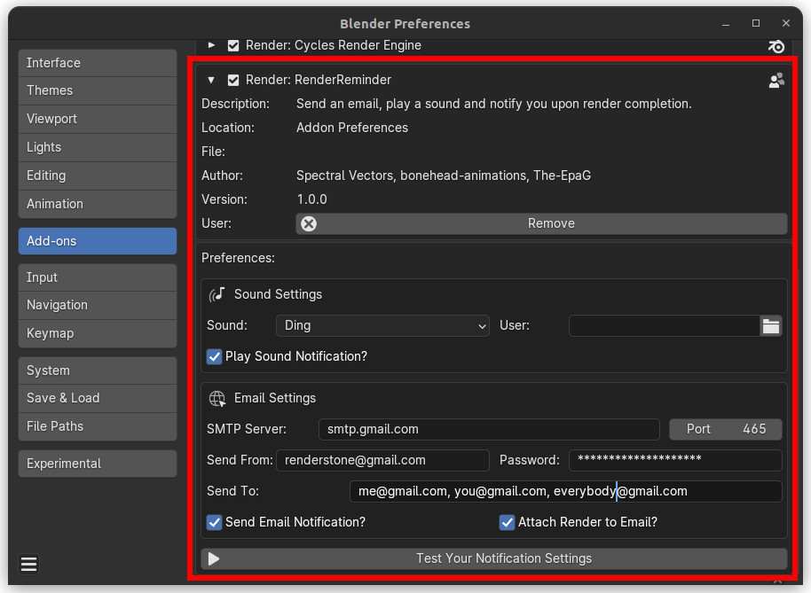

# RenderReminder

<a name="readme-top"></a>

<center>

[![Contributors][contributors-shield]][contributors-url]
[![Forks][forks-shield]][forks-url]
[![Stargazers][stars-shield]][stars-url]
[![Issues][issues-shield]][issues-url]
[![GNU GENERAL PUBLIC LICENSE][license-shield]][license-url]
</center>

<!-- Presentation Images -->
<div align="center">
  
  
</div>

## What It Does

Sends an email and plays a sound to notify you when your Blender render is finished!

## How to Install and Use

Click the image below to view the Install Guide on YouTube:

[](https://youtu.be/U2bitCl0p8w)

## How It Works

This addon uses Python _(smtplib, aud)_ to send an email and play a sound effect once your render is ready.

Blender has a system called App Handlers that run when specific events happen in the application. 

The notification function runs once Blender reports that a render has completed.

### Sound

The addon will play a short Blender synthesized sound effect when the render is finished. 

The sound could be one of two internally generated SFX, or you can load your own sound file.

### Email

The email and sound notifications can be used separately or in combination, selected via the checkboxes in the addon's preferences.

You can add multiple email addresses to the __'Send To:'__ field, separated by commas.

## Limitations

### File without name

The addon will automatically name your render after the time the blend file was opened, and save it in your Documents folder if you do not specify another name and location.

### Gmail Authorization (less secure app)

It uses Gmail and you will need to make sure that [Allow less secure apps is set to ON](https://myaccount.google.com/lesssecureapps) to send the messages. 

I signed up for a separate Gmail account with lower security settings to use as my 'Send From' account, and that sends notification emails to my main email.

### File dimension

It will work for images or animations, however, there may be issues with attachment file size limits if you're dealing with video.

### Save render result

FYI: In order to save the images the addon sets Blender's render option (write_still=True), it is set normally False. The same goes for render caching.

### Managing 2FA for Emails

The plugin currently does not support managing two-factor authentication (2FA) for emails.\
However, you can bypass this requirement by providing an authorized token/password along with the email, thereby avoiding the second authentication check.\
Ensure you use a valid and authorized token/password to ensure uninterrupted access.\
We recommend referring to the email service documentation for specific instructions on how to generate and use such token/password.

#### Documentation for some email providers

- Gmail: [Gmail Documentation](https://support.google.com/accounts/answer/185833)
- Outlook: [Outlook Documentation](https://support.microsoft.com/en-us/account-billing/using-app-passwords-with-apps-that-don-t-support-two-step-verification-5896ed9b-4263-e681-128a-a6f2979a7944)
- Yahoo Mail: [Yahoo Mail Documentation](https://help.yahoo.com/kb/SLN15241.html)
- Apple Mail: [Apple Mail Documentation](https://support.apple.com/en-us/102654)

## Adding a New Notification Method (Developer)

To add a new custom method for notifications, follow the steps below:

1. __Copy the file plugin/sound.py to plugin/\<method>.py:__\
Make sure you have the __sound.py__ file in the plugin folder. Copy it and rename it with the desired name for the new method, for example, __\<method>.py__.

1. __Define the \<method>Plugin Class extending PluginInterface and AddonPreferences:__\
In the __\<method>Plugin__class, you need to extend both __PluginInterface__ and __AddonPreferences__.

1. __Implementa le Funzioni Statiche Obbligatorie:__\
The __PluginInterface__ class requires the implementation of two static functions: __execute__ e __draw__.

    ```python3
    @staticmethod
    def execute(preferences, context):
        pass

    @staticmethod
    def draw(parent, layout):
        pass
    ```

1. __Implementation of the draw Function:__\
For the __draw__ function, refer to the Blender documentation to create an interface for the new method. You can find useful information in the [Blender documentation](https://docs.blender.org/api/current/bpy.types.AddonPreferences.html).

1. __Implementation of the execute Function:__\
The __execute__ function takes the __preferences__ object as the first parameter, which contains the static variables declared in the class. You can access them as instance variables of the __preferences__ object.

Make sure to carefully follow these steps to successfully integrate the new custom method for notifications. Once the implementation is completed, the new method will be available for use within your Blender project.

<!-- LICENSE -->
## License

Distributed under the __GPL-3.0__. See `LICENSE` for more information.

<!-- MARKDOWN LINKS & IMAGES -->
<!-- https://www.markdownguide.org/basic-syntax/#reference-style-links -->
[contributors-shield]: https://img.shields.io/github/contributors/SpectralVectors/RenderReminder?style=for-the-badge
[contributors-url]: https://github.com/SpectralVectors/RenderReminder/graphs/contributors
[forks-shield]: https://img.shields.io/github/forks/SpectralVectors/RenderReminder?style=for-the-badge
[forks-url]: https://ithub.com/SpectralVectors/RenderReminder/network/members
[stars-shield]: https://img.shields.io/github/stars/SpectralVectors/RenderReminder?style=for-the-badge
[stars-url]: https://github.com/SpectralVectors/RenderReminder/stargazers
[issues-shield]: https://img.shields.io/github/issues/SpectralVectors/RenderReminder?style=for-the-badge
[issues-url]: https://github.com/SpectralVectors/RenderReminder/issues
[license-shield]: https://img.shields.io/github/license/SpectralVectors/RenderReminder?style=for-the-badge
[license-url]: https://github.com/SpectralVectors/RenderReminder/blob/main/LICENSE